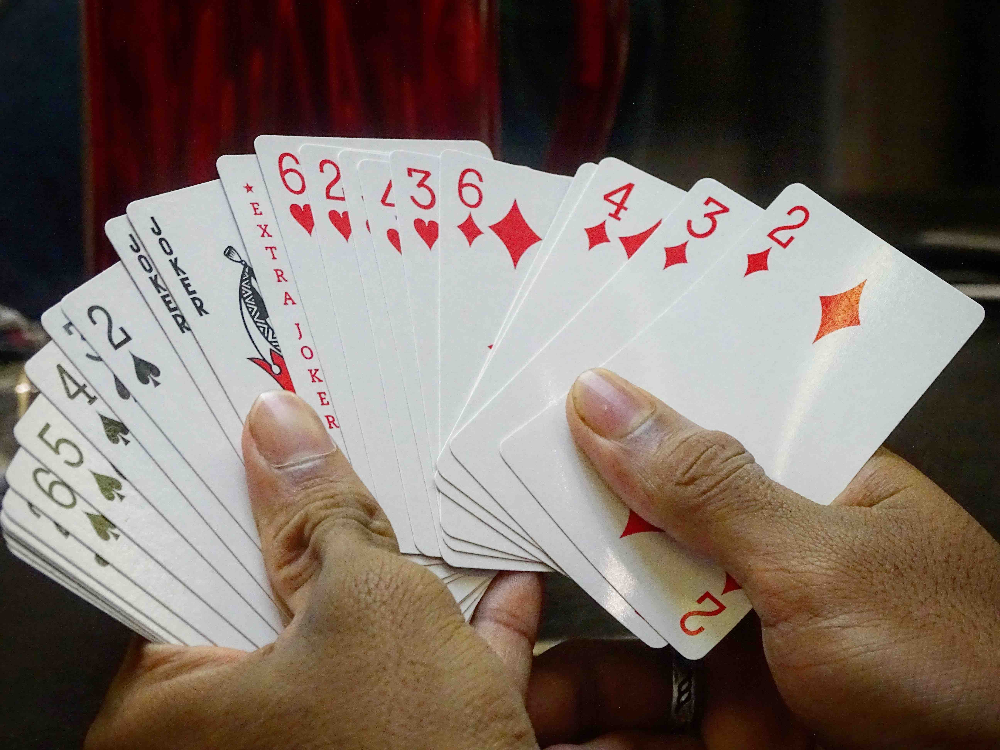

---
aliases:
- /2018/12/10/magic-loop
categories: 
    - riddle
date: '2018-12-10'
difficulty: 3
layout: post
published: true
title: Magic logic

---

At a party last night, my friends Alice and Bob did a magic trick. Any ideas how it worked?

Alice shuffled a pack of cards, and asked me to take five. I looked at them. She put the rest of the pack down on the table. Alice asked for my cards. She had a look at them. She gave four of them to Bob (he was across the table), and the fifth back to me. Bob looked at the four cards for a while. Then Bob looked at me, and named the card I was holding. He was right. I'm quite sure he couldn't have seen it (we weren't sitting by a mirror).

They did the trick again later to someone else. I watched for funny business. Alice didn't say anything to Bob, so I don't think they have a code. Also Alice is famously clumsy, so I doubt it was sleight of hand.

_Hover to show the answer._

When Alice had the five cards in hands, she needs to find a way to select one, and communicate which one she selected to Bob by showing Bob the four other cards.

Here is the way to do that:
- In the five cards, there are always two of the same suite. 
- Alice is going to chose one of those two and tell which one to Bob using the 3 remaining cards. 
- The thing to notice is: when having two cards of the same suite, they are alway 6 cards appart in some direction. For example 7-heart and 9-heart are 2 apart. But queen-spade and 2-spade are 3 apart: queen-king-ace-2.
- Now since there are 12 different cards per suite, two cards are always going to be maximum 6 steps away from each other. 
- So the way to do it is: from the two cards of the same suite, pick the one that allows reaching the other by adding up to 6 steps. So with 7-heart and 9-heart, pick 7-heart. With 2-spade and queen-spade, pick queen-spade.
- Let's continue in the case where Alice picked the queen-spade. 
- Alice gives back to Bob 3 cards + the queen-spade on top. And Bob has to guess 2-spade.
- The goal is now to make the number '3' with the 3 remaining random cards. That way Bob knows he has to add '3' to the queen-spade, which will give him the 2-spade.
- This is easily doable. With 3 cards you can make 6 combinations. Just assign each of them to a number.
- Here is a way to do this: The 3 cards can always be ordered by value. So you can have card-1, card-2 and card-3. The six orders could be: [1-2-3, 1-3-2, 2-1-3, 2-3-1, 3-1-2, 3-2-1]. Here we would select the order '2-1-3' to represent the number 3.
- So Bob sees the queen-spade, and then 3 cards that represent the number '3'. He can now guess the 2-spade.

