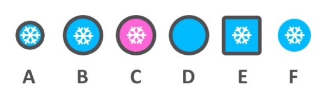

---
aliases:
- /2018/12/10/one-out
categories: 
    - riddle
date: '2018-12-10'
difficulty: 2
layout: post
published: true
title: Exception

---

Find the exception

{:width="400px"}

_Hover to show the answer._

B is the exception.

It is the only one that is only one difference away from every other one.

- A and B have radius in difference
- A and C have color in difference
- A and D have snowfloake in difference
- A and E have shape in diffrence
- A and F have border in difference.

If you select another one, like D, it can have 2 differences to some.

