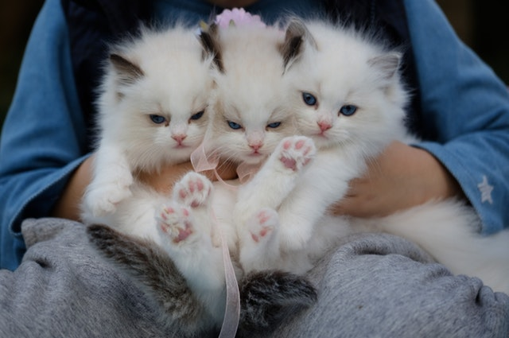

---
aliases:
- /2018/12/25/cats-and-mouses
categories: 
    - riddle
date: '2018-12-25'
difficulty: 1
layout: post
published: true
title: Cats and mouses

---

If 3 cats take 3 minutes to catch 3 mouses, how many cats are needed to catch 100 mouses in 100 minutes ?

_Hover to show the answer._

You also need 3 cats. 

If 3 cats take 3 minutes to catch 3 mouses, it means each cat takes 3 minutes to catch its own mouse. 
In 100 minutes, each of those cats will catch on average 33.333... mouses. So 3 cats are enough to catch 100 mouses in 100 minutes.

Said differently, if 3 cats take 3 minutes to catch 3 mouses, these 3 cats catch 1 mouse/minute. 
At that rate, they will capture 100 mouses in 100 minutes.

