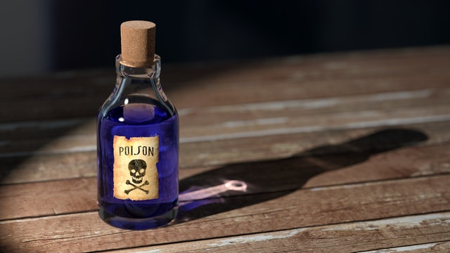

---
aliases:
- /2018/12/25/poison
categories: 
 - riddle
date: '2018-12-25'
difficulty: 2.5
layout: post
published: true
title: King's poison

---

In a far away land, it was known that if you drank poison, the only way to save yourself is to drink a stronger poison in the next 12 hours, which neutralizes the weaker poison. 

The king that ruled the land wanted to make sure that he possessed the strongest poison in the kingdom, in order to ensure his survival, in any situation. So the king called the kingdom's pharmacist and the kingdom's treasurer, he gave each a week to make the strongest poison. Then, each would drink the other one's poison, then his own, and the one that will survive, will be the one that had the stronger poison. 

The pharmacist went straight to work, but the treasurer knew he had no chance, for the pharmacist was much more experienced in this field, so instead, he made up a sneaky plan to survive and make sure the pharmacist dies.

On the last day the pharmacist suddenly realized that the treasurer would know he had no chance, so he must have a plan. After a little thought, the pharmacist realized what the treasurer's plan must be, and he concocted a counter plan, to make sure he survives and the treasurer dies. When the time came, the king summoned both of them. They drank the poisons as planned, the treasurer died, and the pharmacist survived. 

What happened ? What was the treasurer's plan ? What was the pharmacist counter-plan ? And did the king get what he wanted ?

_Hover to show the answer._

The treasurer's plan was to drink a weak poison before going to the king's challenge, and bring water to the challenge. In front of the king, he would drink the strong pharmacist's poison, which would neutralize his, and then drink the water he brought. On the opposite, the pharmacist would drink water, followed by his own poison, and then die. 

When the pharmacist realises that, he decides to also bring water. That way he drinks water both times, and the treasurer dies from his weak poison. 

