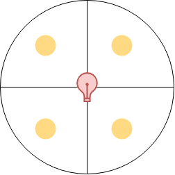

---
aliases:
- /2018/12/26/4-pieces
categories: 
 - riddle
date: '2018-12-26'
difficulty: 2.5
layout: post
published: true
title: 4 Pieces

---

There are 4 coins on a quadrant. They are not visible to you.

{:width="300px"}

If the 4 coins are heads or the four coins are tails, the center light will light up.
You have 5 turns to make the center light light up.
Each turn, you can choose 2 coins that you reveal (you see if they are heads or tails) and you can flip any of them if you want to. You can flip one, both, or none. After that, they are hidden back from you.
After each turn, we spin the quadrant so fast that you can not keep track of wich two coins you interacted with last turn. 
If the coins are randomly initialized, what strategy allows you to be sure to turn the light on ?

_Hover to show the answer._

By following [this strategy](coins.png), you will be sure to turn on the light.

