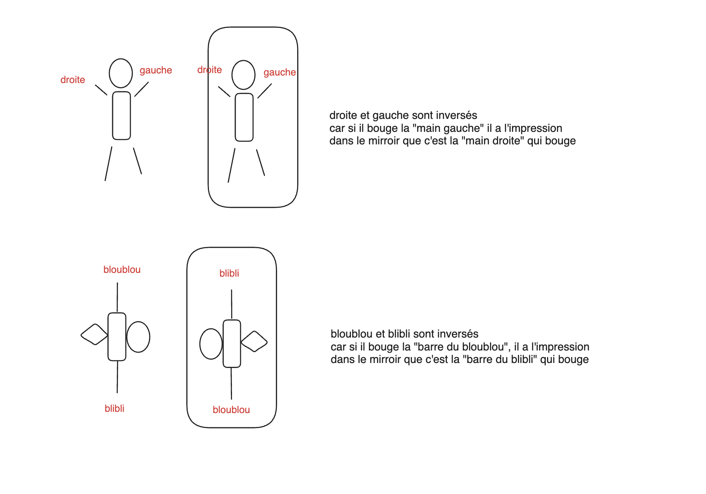

---
aliases:
- /2025/03/16/mirror-flip
categories: 
 - riddle
date: '2025-03-16'
subtitle: difficulty 8
layout: post
published: true
title: The mirror flip

---

You are looking to your reflection in a mirror. 
If you move your right hand, your reflection seems to be moving its left hand. 
However, if you move your head (your top), your reflection is also moving its head (its top). 
Why is the reflection flipped left/right but not top/bottom?

_Hover to show the answer._

The way I understand it is the following:

- The mirror is simply reflecting everything exactly in front of where it is. There is not yet any concept of right/left or top/bottom

- Since, as humans, we are used to refer to left and right in reference to our head and feet, we are under the impression that the being in the mirror is moving its left hand. But notice that if we define "right" as "the side of the heart", then we could not say that the reflection is moving his left hand. So this is only in reference to the head and feet. 

- Picture a being that is symmetric in the other direction, as pictured here. We would call "bloublou" and "blibli" the 2 directions that are indistinguishable. For that being, moving the "bloublou" side and looking into the mirror, it would be under the impression that the "blibli" side is moving. Because compared to the non-symmetrical parts of his body, this is what seems to be moving. 

