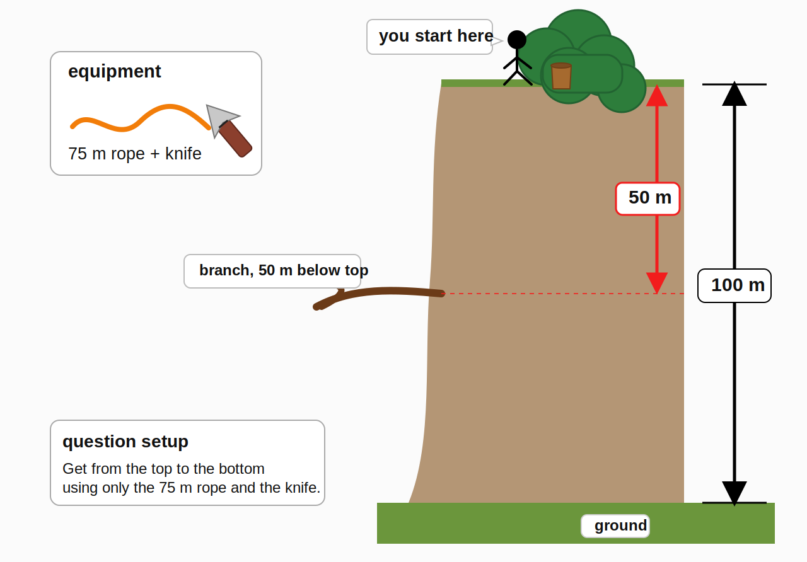

---
aliases:
- /2026/05/03/down-the-cliff
categories: 
 - riddle
date: '2026-05-03'
subtitle: difficulty 7
layout: post
published: true
title: Down the cliff

---

You are standing at the top of a 100 meter cliff.

There is a tree at the top of the cliff, and a branch sticking out of the cliff 50 meters below you. You have a 75 meter rope and a knife.

How can you get down safely to the bottom of the cliff?

_Hover to show the answer._

Cut the rope into two pieces: one of **25 meters** and one of **50 meters**.

Tie one end of the 25 meter rope to the tree. At the other end of that rope, make a loop. The loop now hangs 25 meters below the top of the cliff.

Pass the 50 meter rope through the loop, so that it is folded in two equal parts. Each side of the folded rope is 25 meters long, so the two loose ends reach exactly to the branch, which is 50 meters below the top:

- 25 meters from the tree to the loop,
- then 25 meters from the loop to the branch.

Climb down using the doubled 50 meter rope until you reach the branch.

Once you are on the branch, pull one end of the 50 meter rope to retrieve it from the loop. You now have the full 50 meter rope with you.

Attach this 50 meter rope to the branch, then climb down the remaining 50 meters to the bottom of the cliff.

