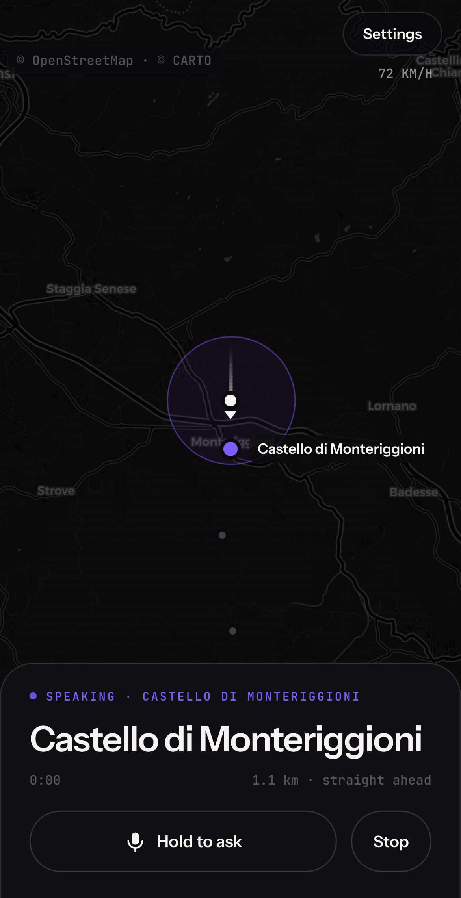
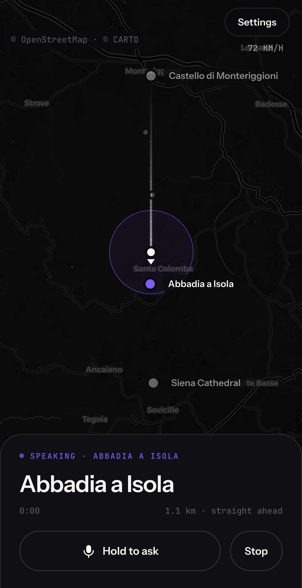

---
aliases:
- /2026/08/10/discover-road-trip-narrator
categories:
 - project
date: '2026-08-10'
subtitle: a road trip guide that talks about what you are driving past
layout: post
published: true
title: Discover — a road trip narrator

---

[**Discover**](https://discover-on-the-road.vercel.app/) is a web app you mount on
the dashboard. It watches your GPS while you drive and talks to you about the
places you pass — the region you are crossing, its history, and the specific
things around the car right now. There is nothing to set up beyond an OpenAI key.

::: {layout-ncol=3}

:::

The map is the whole app. The circle is the detection radius around the car, the
trail behind it is where you have been, and the place currently being spoken
about is the one in violet. Everything else is grey: named if it may still be
worth a sentence, an anonymous dot if it was scored and passed over. There is no
transcript, because the narration is audio — what is being said is in the air.

## What it actually does

1. **Position.** High-accuracy `watchPosition`, with cached and coarse fixes
   thrown away. Narration waits until the fix settles, because a phone's first
   fixes can be kilometres off.
2. **Research.** Every few kilometres: reverse geocoding through Nominatim,
   Wikipedia geosearch in the local-language edition first, Wikivoyage for the
   character of the area, and live web search for what encyclopedias are weak on.
3. **Relevance.** Each candidate is scored — fame from live pageviews, article
   depth, proximity, topic. The bar is roughly what a good local guide would
   bother to mention. In the third screenshot you can add **special interests**;
   they lower the bar for their own subject, so a railway halt that the general
   bar skips gets narrated if you asked for railways.
4. **Approach, not proximity.** A landmark is resolved against your heading and
   speed, so it is announced once, shortly before it is visible, and on the
   correct side. In the screenshots: *1.1 km · straight ahead*.
5. **Voice.** One OpenAI Realtime session over WebRTC. No text at any point — the
   words live in the audio. Hold the button to ask a question; the narrator can
   look something up mid-sentence and carry on.

## Practical

The key is stored in your own browser and sent only to OpenAI. Driving costs
roughly $0.15–0.40 an hour. The data sources — Nominatim, Wikipedia, Wikivoyage —
are free and need no keys.

It is a browser tab, so it cannot run with the screen off; a wake lock keeps the
screen on while mounted, like a navigation app. There is also a native iPhone
version of the same engine.

The screenshots above come from the app's own test drive: the road south from
Monteriggioni to Siena, with the GPS fixes scripted and the voice server faked,
so the same drive can be replayed on every change. The map, the tiles and the
places are real; the car is not.

Source: [github.com/RCambier/Discover](https://github.com/RCambier/Discover).
