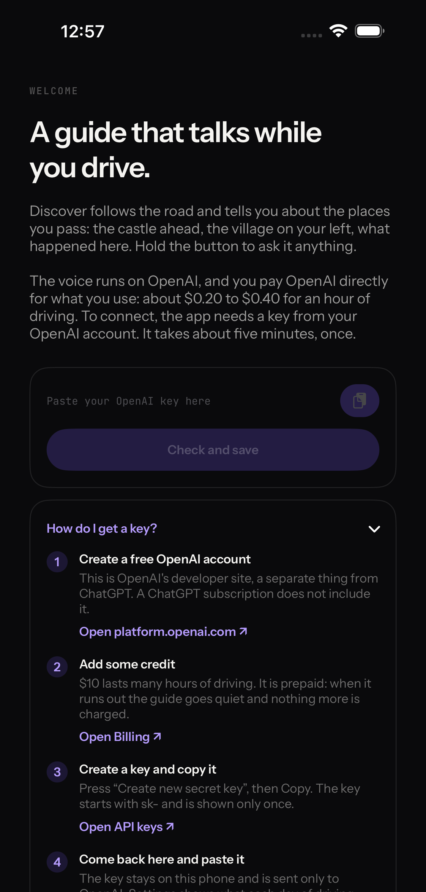
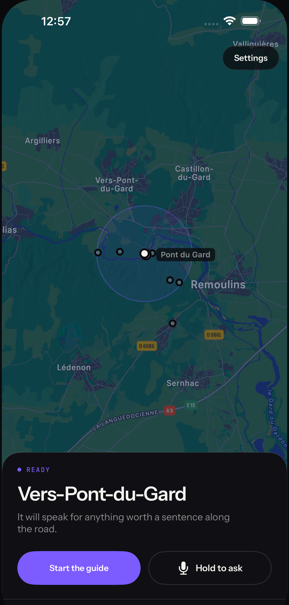
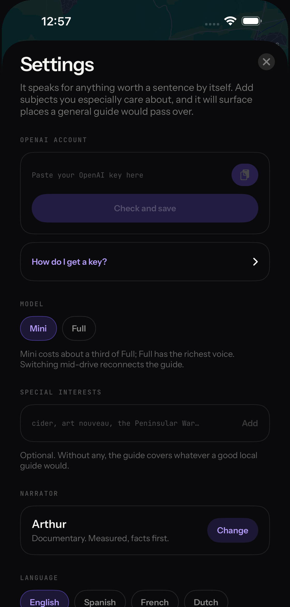

---
aliases:
- /2026/08/10/discover-road-trip-narrator
categories:
 - project
date: '2026-08-10'
subtitle: it talks about what you are driving past
layout: post
published: true
title: Discover, a road trip narrator
description: "A guide that talks while you drive: the castle ahead, the village on your left, what happened here. Runs on your own OpenAI key."
image: discover-banner.png
---

[**Discover**](https://discover-on-the-road.vercel.app/) is a small app I built for road trips.
Put your phone on the dashboard and it tells you about what you are driving past: the castle on
the hill, the village on your left, what happened here. Nothing to read, everything is spoken.

::: {.phone-shots layout-ncol=3}

:::

Every few kilometres it looks up what is around you (Wikipedia in the local language, travel
guides, the web) and decides if something is worth a sentence. The bar is what a good local guide
in the passenger seat would point out. It speaks once, a bit before the place comes into view, and
tells you which side to look. If you want to know more, hold the button and ask.

You can tell it what you like in the settings. Say "railways" and it will happily talk about a
small station everybody else drives past in silence.

It runs on your own OpenAI key, which stays on the phone. An hour of driving costs about 20 to 40
cents. There is a web version and an iPhone version. The screenshots are from the iPhone one, on
the road near the Pont du Gard.
