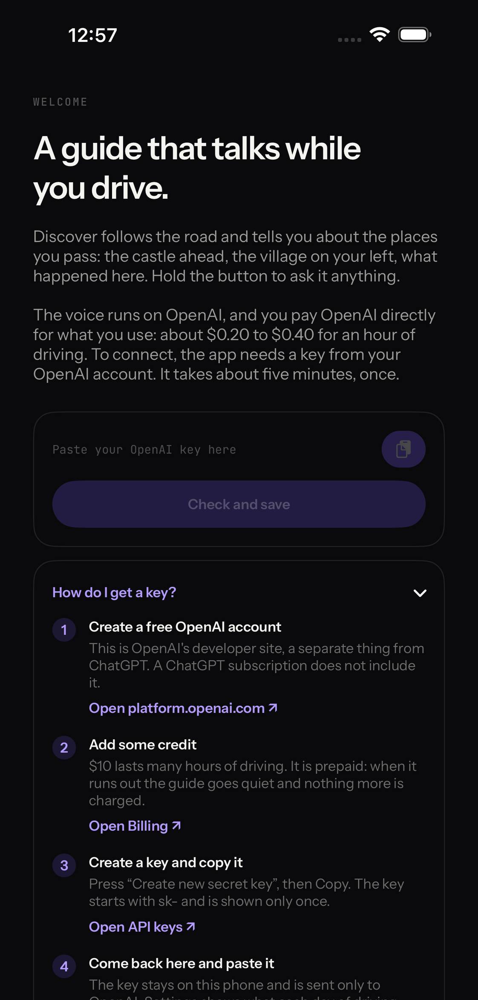
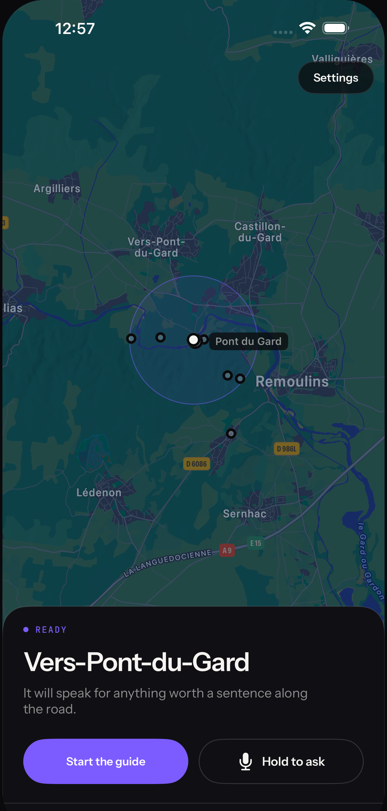
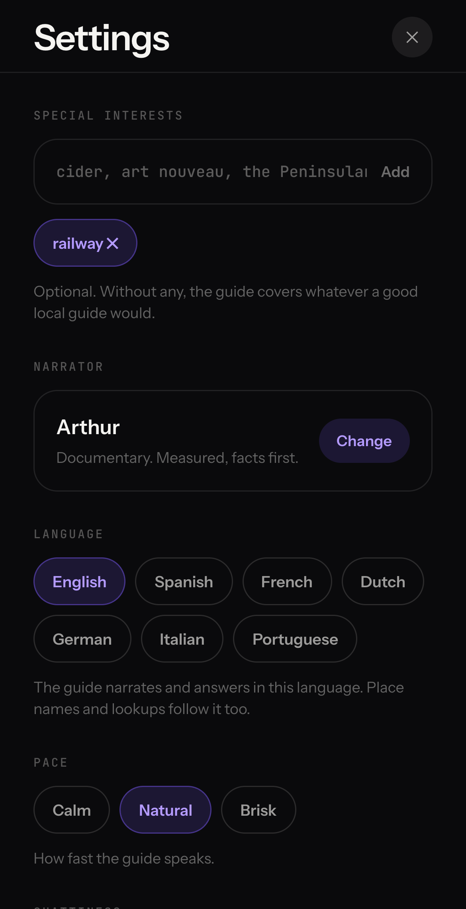

---
aliases:
- /2026/08/10/discover-road-trip-narrator
categories:
 - project
date: '2026-08-10'
subtitle: it talks about what you are driving past
layout: post
published: true
title: Discover, a road trip narrator
description: "An iPhone guide that talks while you drive: the castle ahead, the village on your left, what happened here. Claude writes the words and ElevenLabs speaks them, on your own keys."
image: discover-banner.png
---

[**Discover**](../discover/index.qmd) is a small iPhone app I built for road trips.
Put your phone on the dashboard and it tells you about what you are driving past: the castle on
the hill, the village on your left, what happened here. Nothing to read, everything is spoken.

::: {.phone-shots layout-ncol=3}

:::

Every few kilometres it looks up what is around you (Wikipedia in the local language, travel
guides, the web) and decides if something is worth a sentence. The bar is what a good local guide
in the passenger seat would point out. It speaks once, a bit before the place comes into view, and
tells you which side to look. If you want to know more, hold the button and ask.

You can tell it what you like in the settings. Say "railways" and it will happily talk about a
small station everybody else drives past in silence.

The words come from Claude, by Anthropic, and the voice from ElevenLabs. It needs a key for each,
which you create yourself and which stay on the phone. You pay each of them directly: about 30 cents
an hour of driving for the words, and an ElevenLabs plan for the voice (the free one gives about ten
minutes of speech a month). You can pick any voice on your ElevenLabs account. The
[app page](../discover/index.qmd) shows how to get both keys. The screenshots are from the road
near the Pont du Gard.
