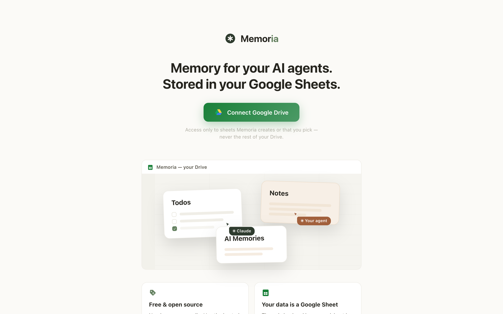
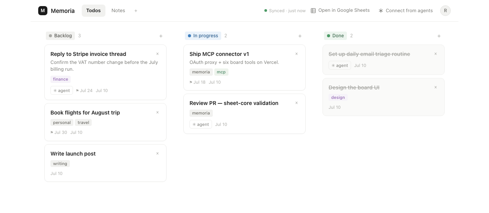

---
aliases:
- /2026/08/10/memoria-boards-in-google-sheets
categories:
 - project
date: '2026-08-10'
subtitle: kanban boards and notes whose only backend is a sheet you own
layout: post
published: true
title: Memoria — a board your agents can write to

---

[**Memoria**](https://memoria-board.vercel.app/) is a kanban board and a grid of
markdown notes whose only backend is Google Sheets in your own Drive. There is no
database, no server-side state, and no account to create beyond the Google one
you already have.

Two clients read and write the same sheet: the web app below, and an MCP server
for coding agents. Neither holds state, so the board, your agents and Google
Sheets itself are always looking at the same rows.

## Why a spreadsheet

Because it outlives the app. The tasks are plain rows in a file you own, readable
in ten years with or without this front end, and editable in Google Sheets
directly if the UI is ever in the way. The deployment stores nothing about you:
it is static files plus a stateless endpoint, and the only credential involved is
your own Google sign-in. The app asks for the `drive.file` scope, so it can touch
only the files it created or that you explicitly picked — never the rest of your
Drive.

## The agent half

Every deployment serves an MCP connector at `/api/mcp`. Add it in claude.ai under
Connectors, or in Claude Code, sign in with Google, and an agent gets the board
tools against your own boards — listing, adding, moving and completing tasks, and
the same for notes. Nothing to install, and it works in scheduled and cloud runs
too.

That is the part I actually wanted: a place an agent can leave something for me,
and I can leave something for it, that is neither a chat log nor a file in a repo.

## Practical

Use the hosted instance at
[memoria-board.vercel.app](https://memoria-board.vercel.app), or fork the repo and
deploy your own with your own Google credentials — about fifteen minutes, all on
free tiers.

Source: [github.com/RCambier/Memoria](https://github.com/RCambier/Memoria). MIT.
