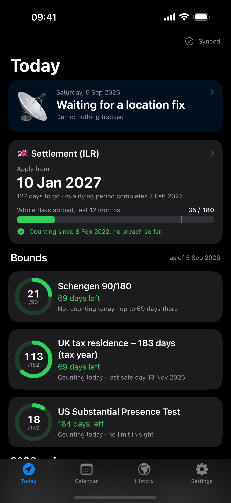
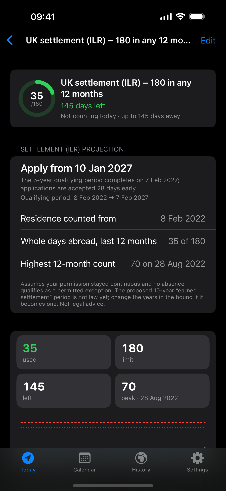
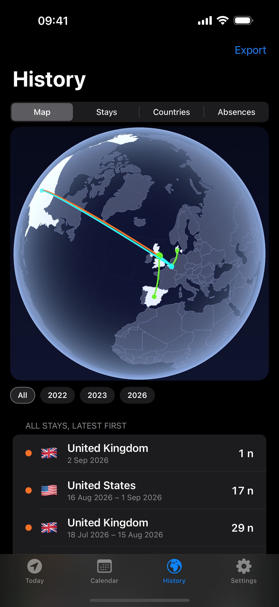

---
aliases:
- /2026/09/05/daybound-days-abroad-in-your-own-sheet
categories:
 - project
date: '2026-09-05'
subtitle: an iPhone app that counts your days outside the country
layout: post
published: true
title: Daybound, days abroad in your own sheet
description: "An iPhone app that records the country you sleep in every night, writes it to your own Google Sheet, and counts days for UK settlement, Schengen and tax rules."
image: daybound-banner.png
---

[**Daybound**](https://rcambier.github.io/locationtrack/) is an iPhone app I built because I live
in the UK on a visa, and my days outside the country matter. For settlement you cannot be away
more than 180 days in any 12 months. There is a Schengen limit and a tax one too. For four years I
kept this in a spreadsheet by hand, one row per day. I wanted the phone to do the writing, and to
keep the spreadsheet.

::: {.phone-shots layout-ncol=3}

:::

Every night it records the country you sleep in, without you opening it. The next morning it
writes one row to your sheet: the date, the country, and a place for evidence like a flight
number.

Then it counts, and every rule counts differently. UK settlement only counts whole days away, so
the day you leave and the day you come back do not count. Schengen counts any part of a day. Tax
residence looks at where you are at midnight. Open a day and it tells you which rules it counts
for and why. The settlement screen tells you the earliest day you can apply. That is how I found
out I had broken the 180-day rule in 2023 without noticing.

Your history is a normal Google Sheet in your Drive. Send it to a lawyer, back it up, delete the
app: the rows stay. There is exactly one manual button, "Correct this day", and it asks why. The
reason goes in the sheet next to the day.

It is free on the App Store, no subscription, no account with me. Every screen works with demo
data before you sign in. It is not legal or tax advice.
