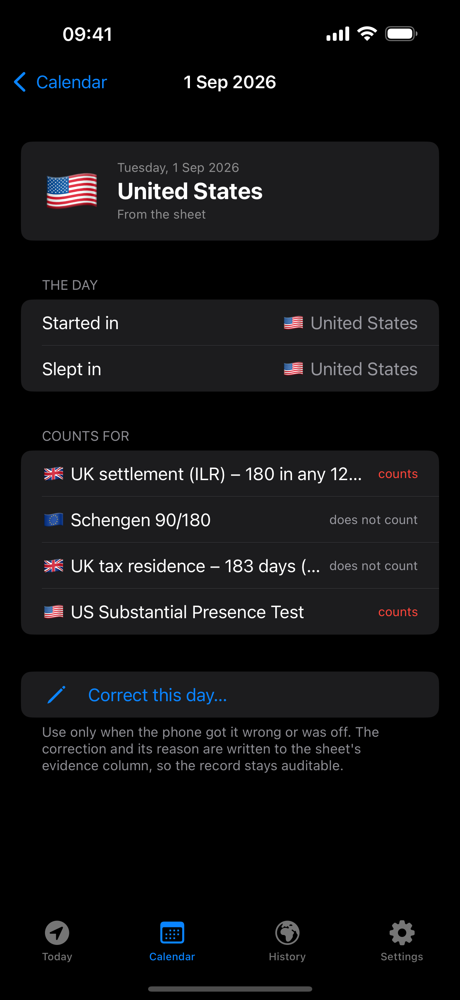

---
aliases:
- /2026/09/05/daybound-days-abroad-in-your-own-sheet
categories:
 - project
date: '2026-09-05'
subtitle: an iPhone app that counts your days abroad and keeps them in a Google Sheet you own
layout: post
published: true
title: Daybound — days abroad, in your own sheet

---

[**Daybound**](https://rcambier.github.io/locationtrack/) is an iPhone app I
built because I live in the UK on a visa, and the number of days I spend
outside the country matters. For settlement you cannot be away more than 180
days in any twelve months. There is a Schengen limit too, and a tax one. I had
been keeping all of this in a spreadsheet by hand for four years, one row per
day, and I wanted the phone to do the writing for me without taking the
spreadsheet away.

::: {layout-ncol=3}

:::

## What it does

It records the country you sleep in, every night, without you opening it.
iOS wakes the app when the phone moves a few hundred metres or settles
somewhere, the app works out the country, and the next morning it writes one
row to your sheet: the date, the country, and a place for evidence like a
flight number.

Then it counts. The interesting part is that every rule counts a day
differently. UK settlement only counts whole days outside the country, so the
day you leave and the day you come back do not count. Schengen counts any part
of a day, so they both do. The tax residence test looks at where you are at
midnight. Daybound knows the definition for each rule, and when you open a day
it tells you which rules it counts for and why.

The settlement screen goes one step further and tells you the earliest day you
can apply, starting from the day your visa started, and starting over if you
ever broke the 180-day rule. I learned from it that I had broken it in 2023
without noticing.

## Why a spreadsheet

Because these numbers matter for years, and an app is only as durable as the
app. Your history is an ordinary Google Sheet in your own Drive. You can open
it, send it to a lawyer, back it up, or delete the app; the rows stay. The app
creates the sheet itself and can only see the files it created, nothing else in
your Drive.

There is a second sheet with every location fix the phone ever took, and you
can import your Google Maps Timeline export into it, so the past is yours as
well.

## The one manual button

I removed every way of typing days in by hand. There is exactly one: "Correct
this day", and it asks why. The reason goes into the sheet next to the day, so
if anyone ever asks, the record explains itself.

## Getting it

Daybound is free on the App Store, with no subscription and no account with
me. Every screen works with demo data before you sign in with
Google, so you can look around first. It is not legal or tax advice; check the
rules that apply to you.
