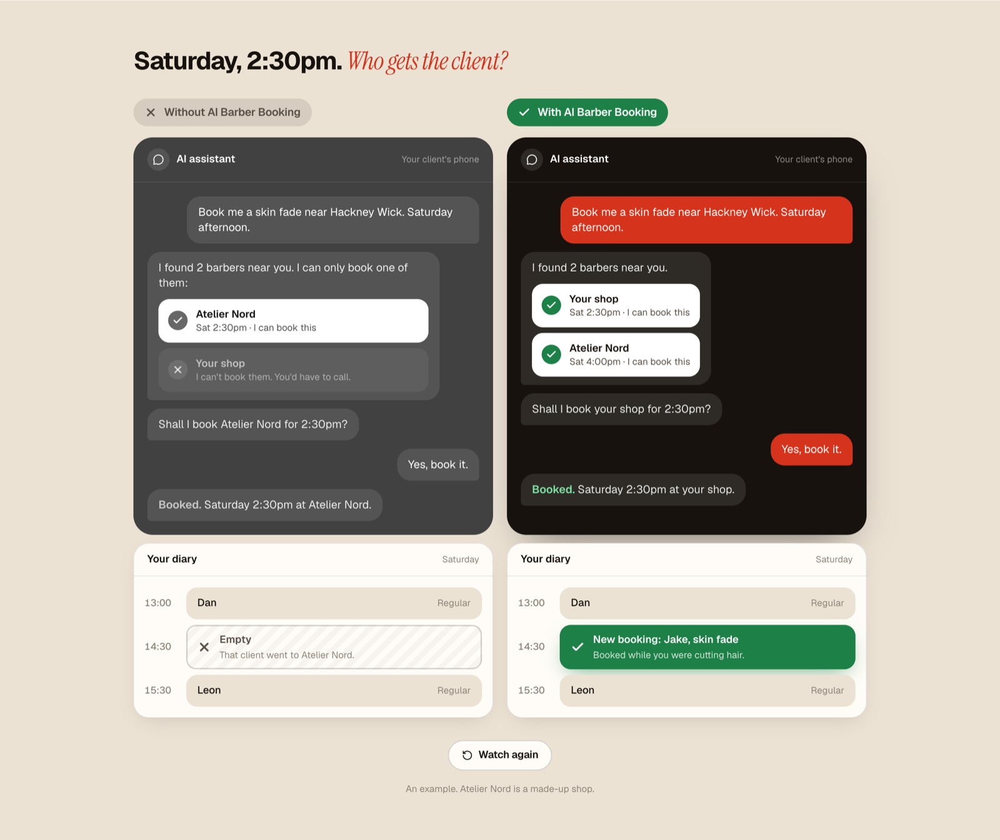

---
aliases:
- /2026/09/27/ai-barber-booking
categories:
 - project
date: '2026-09-27'
subtitle: a booking layer for AI assistants, starting with hairdressers
layout: post
published: true
title: AI Barber Booking, an MCP layer for local services
description: "An MCP layer that lets Claude or ChatGPT check a local business's free times and book it. It starts with barbers and hairdressers in Hackney Wick."
image: ai-barber-booking-banner.png
---

[**AI Barber Booking**](https://ai-barber-booking.vercel.app/) started with a simple question: can
I ask Claude to book me a haircut? Not really. It finds the barber, gives me a link, and that is
it. It cannot see when they are free, and it cannot book. Same for the physio, the dog groomer and
most local services.

So the idea is one MCP layer that makes most of these services bookable by AI. They all look the
same underneath: a menu with prices and durations, people, opening hours, a diary. I am starting
with hairdressers and barbers, because a haircut is the easiest thing to ask your phone for.

{.shot}

The MCP server gives an assistant what it needs: find a shop, read the menu, check free times, hold
a slot while you say yes, then book, move or cancel. I made up a salon, Atelier Nord, gave Claude
one sentence, and it booked me a skin fade. A second Claude found a bug on its first try, which I
suppose is the point.

Then I checked 17 barbers and salons around Hackney Wick. None of them can be booked by an AI yet.
Each one gets its own page showing the same client asking the same phone twice: once the booking
goes next door, once it lands in their diary.

Next is setup in a few minutes, for any shop on any booking tool. Then the next trade.

Try it with Claude Code:

```bash
claude mcp add --transport http ai-barber-booking https://ai-barber-booking.vercel.app/api/mcp
```
