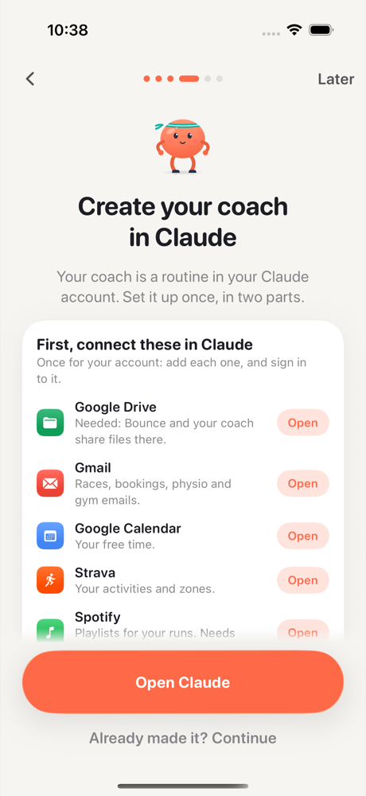
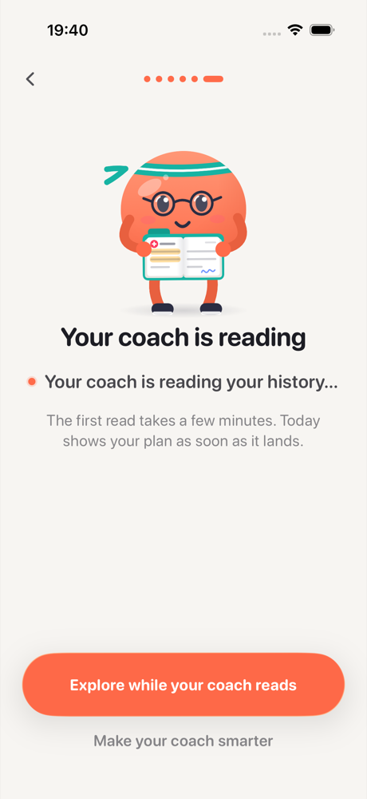

---
aliases:
- /2026/10/02/bounce
categories:
 - project
date: '2026-10-02'
subtitle: a natively multisport iPhone coach that knows the whole context
layout: post
published: true
title: Bounce, what to do next
description: "A natively multisport iPhone app whose coach runs in the person's own Claude: it merges every source, keeps a memory, and plans only the next one to three sessions."
image: bounce-banner.png
resources:
 - bounce-running.gif
 - bounce-tennis.gif
 - bounce-plugging.gif
---

**Bounce** is an iPhone app, in testing, that reads a person's sports and health history from the
apps and devices they already use, and suggests only the next one to three sessions. There is no
plan to pick and no form to fill in.

It is multisport by design. Most apps are built for one sport: a running plan, a gym log, a cycling
tool. In Bounce, every sport lands in one timeline and counts in one training load and one recovery
picture, and one plan balances them: a run, a padel match and a strength session in the same week,
with rest where the body needs it.

A round mascot does the sports. Claude does the reasoning.

::: {.mascot-gifs layout-ncol=3}

:::

**Two parts.** The coach runs in the person's own Claude. It is a Claude Code routine in their
Claude account (Pro or Max), and it does all the thinking: it merges the sources, understands the
person, and plans the next sessions. Bounce, the iPhone app, is the frontend. It reads what only the
phone can read, shows everything, sends sessions to the Apple Watch, the calendar and Garmin, and
checks every plan with a safety gate before the person sees it.

**One folder.** The data lives on the iPhone and in a "Bounce" folder in the person's own Google
Drive. Bounce asks Google only for `drive.file` access: it sees the files it made there, and nothing
else. The phone writes each source's records, the person's messages, check-ins and corrections, and
a README that tells the coach what to do. The coach writes back its memory, one merged timeline and
the plan. No server stores anything. Bounce's own server is being reduced to a small sign-in helper
for WHOOP, Oura, Withings and Polar.

**Setup.** The setup is calm, one step per screen, with the mascot at each: Apple Health; Google
Drive, where Bounce makes the folder; the coach in Claude, with the connectors to add and the
routine's form row by row, with copy buttons; the routine's Token and Fire URL, which Bounce takes
from the clipboard; and the coach's first read. The token can start this one routine and nothing
else, and it stays in the iPhone's Keychain.

::: {.phone-shots layout-ncol=2}

:::

**Sources.** The phone reads:

- Apple Health, including what the Apple Watch, Garmin, WHOOP and Oura write to it: workouts, heart
  rate, heart rate variability, sleep, VO₂ max.
- WHOOP, Oura, Withings and Polar directly, Intervals.icu, and the Garmin account export for the
  years before.
- The iPhone calendars: free time in the coming week, and past sport events.
- Location and weather, everyday movement, and the photo library, where sports in photos are
  detected on the phone.

Claude's connectors bring the rest of the context to the coach:

- Gmail: race entries, bookings, gym and club memberships, and care emails such as physio or
  imaging appointments.
- Google Calendar, and the Drive documents the person points to, such as a report or a training
  plan.
- Strava: activities, their names, who took part, heart rate zones and gear.
- Spotify: the coach makes the playlist for a run.
- Optional: Alma for meals and nutrition, AllTrails for trails nearby, Health Data Avatar for health
  records.

Each source on the phone has a page that says what it reads and why. Turning a source off
disconnects it and deletes what it gave.

**When it thinks.** Bounce starts the routine through its API when something happens. A message, a
check-in or a correction starts a run at once. New workout data waits until no new record has come
for 30 minutes, so the watch, Strava and WHOOP have all synced before the merge. The routine also
runs every morning on its own schedule. A run takes minutes, so Today answers at once, then shows
the coach's live steps ("Reading your history", "Checking the plan against your ledger"), and, when
the plan lands, one calm line on what changed: "Friday's usual intervals become rest: last week
carried 1.6 times your usual load and HRV is below your normal."

**Merging.** Sources overlap and disagree. The same run can be in Garmin, Apple Health and Strava,
and two devices can report different sleep. The coach merges everything into one timeline before it
plans:

- A session recorded several times counts once, across watches, phones and apps. Distance comes
  from the GPS device, heart rate from the record that has it, and the name and group size from
  Strava.
- Each metric follows one source, the one with the most data in the last four weeks or the one the
  person picks, never an average of several.
- An event in two calendars counts once.
- The person's corrections always win: two sessions joined, one split, "not mine", another sport,
  the distance from another source.

The coach keeps its merge code in the folder, so the next run places only what is new. In the tests,
a day more takes about 3 minutes, against 25 for the first merge. On 50 known cases, Claude's merge
is as good as the app's own engine: 17 problems against 18 with all the cases at once, and every
kind of correction applied.

**Memory.** The coach keeps its memory in the folder:

- An athlete model: sports, baselines, goals, events and patterns. Each fact carries its evidence
  and its date.
- A health ledger: every injury, illness and piece of advice, with its history. It is never
  shortened, and an item closes only on the person's word or on clear new evidence.
- A watchlist of what to keep an eye on, and open questions, never asked twice.

Daily runs are light: they read what is new. Once a week, a deep run rebuilds the athlete model from
all the evidence, so the memory does not drift, learns from the sessions that were done or skipped,
and plans the coming week. The evidence keeps an order: the person's own words, then reports they
shared, care emails, then devices. Newer beats older. The phone checks each memory file before it
keeps it: a ledger that lost an item is refused, and the last good one stays.

**Input.** One input bar takes text, voice, photos, document scans and files: "I feel a bit sick
since Sunday", "the knee is fine again", "I want to run with friends when it is sunny". Speech is
transcribed on the phone.

::: {.phone-shots layout-ncol=2}

:::

**Today.** One sentence, the goals, and the next one to three sessions. Sessions go in free
calendar slots, in good weather for outdoor sports, at places the person uses: the gym they pay
for, the club, the usual park. Each card shows the steps and their minutes, and can be sent to the
Apple Watch, the calendar or, through Intervals.icu, a Garmin.

**Every sport.** Each sport the person does gets a short setup of a few taps: where, which gear,
level, what they want, how many days a week and how long. Progress and personal bests use one model
for every sport, and every session counts in the same training load and recovery picture. What only
one sport needs stays specific to it. Two examples:

- **Weightlifting.** The setup asks where the person lifts and with what: barbell and rack, bench,
  dumbbells and the heaviest one at home, kettlebells, pull-up bar, bands, machines. From that, Bounce
  builds a movement pool out of 45 exercises across 9 patterns (squat, hinge, single leg, push and pull
  in two directions, carry, core). An exercise that loads an injured area is paused: a sore right
  shoulder removes overhead pressing until it heals. Claude plans each session from the pool with sets,
  reps, kilograms and rest, and moves the load up with double progression (+2.5 kg on a barbell), with
  a lighter week every 4 to 5 weeks and never more than the heaviest dumbbell at home. After the session,
  one tap logs it as planned, or the sets can be adjusted. The estimated one-rep max and the best for
  5, 3 and 1 reps update by themselves. On the Apple Watch, each set is a step, with timed rests.
- **Running.** The setup asks about surfaces, shoes, a heart-rate strap and races. Every run counts
  once, even when the watch, Garmin and Strava all recorded it. Bounce keeps the best 1 km, 5 km,
  10 km, half and marathon times. Suggestions come as structured sessions (warm-up, intervals at a
  heart-rate zone, cool-down) that go to the Apple Watch or, through Intervals.icu, to a Garmin. A low
  readiness day turns intervals into an easy run, and a sore Achilles removes speed work.

Cycling, swimming, tennis, padel, yoga and team sports land in the same timeline and the same weekly
load, so a hard padel match on Tuesday makes Wednesday's run easier.

**Music.** The coach also picks what to listen to for each session. With Spotify connected in
Claude, it makes a playlist as long as the session, from the person's own taste: at a running tempo
for intervals, something calm for yoga. For a long easy run, it finds an episode of a show the
person follows. The session's card opens it in Spotify.

**Recovery.** Every day, heart rate variability, resting heart rate, sleep and training load are
compared with the person's own normal over the last 60 days, and the day is rated "ready to push",
"good to go" or "take it easy". The last four weeks show as one bar per day.

**Health record.** Each injury or illness in the coach's health ledger has its own card: the body
part, the diagnosis, since when, its status, and a recovery bar. Below it, the pain scores from the
daily 0-to-10 check-in form a line over the last weeks ("pain 4 → 2 in 23 days, easing"), next to
what it changes in the plan ("tennis paused") and where it comes from ("email, physio and MRI").
Past injuries stay with their dates. An illness such as "sick since Sunday" is recorded with its
start date and its fever, and the plan stays easy until it is over, with nothing hard in the 48
hours after a fever.

::: {.phone-shots layout-ncol=2}

:::

**Questions.** When the data is unclear, Claude asks instead of guessing: "In June 2024 you had an
ankle X-ray. What happened?" The answer can be a sentence or a document. A report attached to an
email is downloaded only after a tap.

::: {.phone-shots layout-ncol=2}

:::

**You.** Trends show gaps where there is no data and name the device behind each line. "What your
coach knows" shows the coach's memory: its open questions, the health ledger and its history, the
watchlist, and the athlete model. A tap on an item shows why: its evidence, with dates. "This is
wrong" sends a correction that the next run applies.

**Coaching standards.** The coach follows 96 standards drawn from 113 sources in the sports-science
and sports-medicine literature, from the IOC, ACSM, WHO and others. They cover training load,
intensity, recovery, HRV and sleep, illness (the neck check), the return from injury (pain
monitoring), tapers, beginners, masters athletes, heat and travel, and red flags. Each standard
gives the rule, its evidence, and how to check it in a plan.

**Safety gate.** Before a plan reaches the screen, the phone checks it. It refuses training through
a fever the person reported, anything but rest after chest pain or fainting, sessions that load an
acute injury, and load spikes, such as a run more than 10% longer than the longest of the last 30
days. A refused plan leaves the last good plan in place, and the next run reads why.

**Tested for real.** Eight journeys run live, through a real Drive folder and a real test routine,
step by step over weeks of a person's data: a 10 km build, a cold then a fever, a knee return,
overreaching, a beginner of 52 with chest tightness, a strength plateau, a multisport week, and a
triathlete with jet lag. A judge scores each plan against the standards. Three plans from the real
runs:

- A cyclist has a fever of 38.4 °C, aches and a chest cough: no riding, rest, a doctor soon, and
  urgent care for chest pain, breathlessness or feeling faint. Short easy spins come back after 48
  hours without fever.
- A runner's knee reaches 5/10 in a run-walk and is still at 3 the next morning: one stage back,
  hip work and walks, then the last pain-free stage once the knee has been calm for two days.
- The beginner feels chest tightness on a hill: see a doctor this week, call 112 if it comes back,
  and only gentle walks until then.

Every plan judged so far passes, with scores from 3.8 to 4.0 out of 4. The runs also find bugs in
the app: the first safety gate read "no fever" in a ledger title as a fever. It now reads the
ledger's fever field, never the coach's words.

**Privacy.** The data is on the iPhone, in the person's own Drive folder, and in their own Claude
account, under their Claude privacy settings. The folder gets no exact location, no email address
and no photo except the ones the person attaches, and people's names in titles become "[name]".
One screen shows each step of the last update: what was read, what is kept, what went out, and what
came back.

Bounce is in testing on TestFlight. It runs on the person's own Claude plan, Pro or Max.
